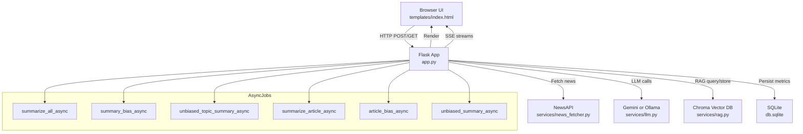

# Bias-Aware News Analyzer

A Flask app that fetches news, summarizes articles/topics with an LLM, analyzes bias, provides retrieval‑augmented Q&A, streams answers live, and tracks evaluation metrics with persistence.

## Quick Start

- Python: `3.10+`
- Install:

  ```bash
  pip install -r requirements.txt
  ```

- Environment (`.env`):
  - `NEWS_API_KEY` = NewsAPI key
  - `LLM_PROVIDER` = `gemini` or `ollama` (Default provider)
  - `OLLAMA_MODEL` = model name when using Ollama (e.g. `llama3.1:8b`)
  - `DEFAULT_COUNTRY` = default country for headlines (e.g. `us`)
  - `GEMINI_API_KEY` = required when `LLM_PROVIDER=gemini`
  - `OLLAMA_BASE_URL` = Ollama server (default `http://localhost:11434`)
  - `CACHE_TTL_SEC` = TTL seconds for NewsAPI cache (default `300`)
  - `MAX_TOKENS` = Max token limit for context window (default `4000`)

- Run:

  ```bash
  python app.py
  ```

- Open `http://127.0.0.1:5000/`

## Video Demo

[](https://www.youtube.com/watch?v=511Ckh9E83w)

*Watch the video demonstration to see the app in action.*


## Features

- **Modern UI**: Premium design with Glassmorphism, Tailwind CSS, and 'Outfit' typography.
- **AI Provider Selection**: Switch between Gemini and Ollama, and configure models directly from the UI.
- **Token Usage Tracking**: Monitor prompt, completion, and total tokens per request via the Metrics Dashboard.
- **Strict AI Output**: Prompts are engineered to provide direct, professional, and concise responses without conversational filler.
- **Article Reordering**: Interacting with an article moves it to the top for better focus.
- **Configurable Context Limits**: User-adjustable context window size (capped by server limit).
- Topic fetch via search or category
- Summarize all articles under a topic
- Topic bias analysis with score visualization
- Unbiased topic rewrite
- Per‑article summarize, bias analysis, and unbiased summary
- RAG Q&A (global and article‑scoped)
- Live streaming answers (SSE) for global and article Q&A
- TTL caching for NewsAPI requests (topic and category)
- Background jobs for slow tasks (async summarize all, topic bias)
- Metrics dashboard at `/metrics` persisted in `db.sqlite`

## Routes

- `GET /` — Home UI rendering (`app.py:242–293`)
- `POST /fetch` — Fetch by search topic (`app.py:295–315`)
- `POST /fetch_category` — Fetch by category (`app.py:316–374`)
- `POST /summarize_all` — Topic summary (`app.py:376–396`)
- `POST /summary_bias` — Bias analysis of topic summary (`app.py:397–413`)
- `POST /unbiased_topic_summary` — Unbiased rewrite of topic summary (`app.py:414–427`)
- `POST /ask_global` — Global Q&A with RAG (`app.py:429–489`)
- `GET /ask_global_stream` — Global Q&A streaming (`app.py:650–716`)
- `POST /summarize_article/<i>` — Per‑article summary (`app.py:491–510`)
- `POST /article_bias/<i>` — Per‑article bias analysis (`app.py:512–537`)
- `POST /unbiased_summary/<i>` — Per‑article unbiased summary (`app.py:556–573`)
- `POST /ask_article/<i>` — Article‑scoped Q&A with RAG (`app.py:576–648`)
- `GET /ask_article_stream/<i>` — Article‑scoped Q&A streaming (`app.py:717–793`)
- `POST /summarize_all_async` — Start summarize‑all job (`app.py:918–924`)
- `POST /summary_bias_async` — Start topic bias job (`app.py:925–931`)
- `POST /unbiased_topic_summary_async` — Start unbiased topic rewrite (`app.py:951–956`)
- `POST /summarize_article_async/<i>` — Start per‑article summary job (`app.py:958–964`)
- `POST /article_bias_async/<i>` — Start per‑article bias job (`app.py:966–972`)
- `POST /unbiased_summary_async/<i>` — Start per‑article unbiased summary job (`app.py:974–980`)
- `GET /job/<jid>` — Job status polling (`app.py:982–984`)
- `GET /suggest` — Title suggestions based on query (`app.py:932–950`)
- `GET /metrics` — Metrics dashboard (`app.py:986–994`)

## UI Behavior

- **Hero Search**: A prominent, centered search section with a gradient background.
- **Glassmorphism Header**: Sticky header with a blur effect for a modern feel.
- **Interactive Cards**: Articles and summaries are displayed in cards with hover lift effects and soft shadows.
- **Bias Visualization**: Bias scores are shown with animated progress bars and color-coded indicators (Green/Yellow/Red).
- **Responsive Design**: Fully responsive layout that adapts to mobile and desktop screens.
- **Streaming Q&A**: Answers stream in real-time with a typewriter effect.
- **Async Jobs**: Long-running tasks (summarization, bias check) run in the background with status indicators.

## RAG & LLM

- Embeddings and vector store handled in `services/rag.py` via Chroma.
- Q&A context is constrained (~1200 chars) and blends topic/article summaries with retrieved snippets.
- LLM provider is configured via env (`LLM_PROVIDER`) with Gemini or Ollama.
- Streaming: Ollama uses server‑side streaming; Gemini yields final result via SDK.

## Metrics & Evaluation

- Counts: summaries (topic/article), bias analyses (topic/article), unbiased summaries, Q&A (global/article).
- Aggregates: average answer latency (ms), average answer word count.
- **Token Tracking**: Tracks `prompt_tokens`, `completion_tokens`, and `total_tokens` for every LLM interaction.
- Examples: list of Q&A entries with type, index, question, words, latency, and token usage.
- View at `http://127.0.0.1:5000/metrics`. Data persists in `db.sqlite`.

## Project Structure

- `app.py` — Flask routes, in‑memory state, caching, metrics, SSE, jobs
- `templates/index.html` — Main UI (Modernized with Tailwind CSS)
- `templates/metrics.html` — Metrics UI (Modernized with Tailwind CSS)
- `services/news_fetcher.py` — NewsAPI integration
- `services/llm.py` — Gemini/Ollama calls
- `services/rag.py` — Chroma CRUD & embeddings
- `db.sqlite` — SQLite database for metrics persistence (auto‑created)

Note: The `services` package uses Python’s implicit namespace packages; `__init__.py` is not required.

## Configuration Notes

- Ollama: ensure the local server is running and the specified model is pulled.
- The app uses `logging` for HTTP/data errors and persists evaluation metrics to SQLite automatically.

## System Architecture



### Data Flow Description

1.  **User Interaction**: The user interacts with the **Browser UI**, initiating requests (search, summarize, analyze) via HTTP POST/GET.
2.  **Request Handling**: The **Flask App** (`app.py`) receives these requests.
3.  **External Services**:
    *   **News Fetching**: The app calls `services/news_fetcher.py` to get articles from NewsAPI.
    *   **AI Processing**: It uses `services/llm.py` to communicate with Gemini or Ollama for summarization and bias analysis.
    *   **RAG System**: `services/rag.py` manages embeddings and retrieval from the Chroma Vector DB for Q&A context.
4.  **Asynchronous Processing**: Long-running tasks like bulk summarization are offloaded to **AsyncJobs** to keep the UI responsive.
5.  **Real-time Updates**: The app pushes updates (like streaming answers) back to the client using **SSE (Server-Sent Events)**.
6.  **Persistence**: Usage metrics and logs are saved to the **SQLite** database (`db.sqlite`).

## Troubleshooting

- Missing NewsAPI key: add `NEWS_API_KEY` to `.env`.
- Ollama connection issues: verify server and model name.
- Vector store errors: ensure `chromadb` and `sentence-transformers` installed; the first run initializes the collection.
- Streaming not working: ensure browser supports `EventSource`; check `/ask_global_stream` and server logs.
- Metrics not persisting: verify write permissions and presence of `db.sqlite` after actions.

## Production

- Use a production WSGI server (e.g. gunicorn + reverse proxy) and proper secret management.
- Consider a proper job queue (RQ/Celery) and a persistent cache for NewsAPI.